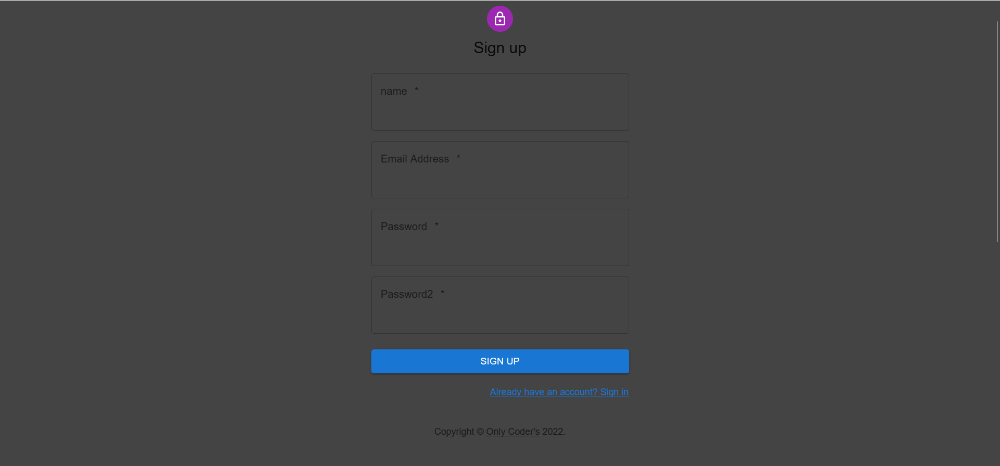

<!-- LOGO -->

<p align="center">
  
</p>

<!-- INDICE -->
<details>
  <summary>Indice</summary>
  <ol>
    <li>
      <a href="#introducción">Introducción</a>
      <ul>
        <li><a href="#descripción">Tecnologías</a></li>
      </ul>
    </li>
    <li>
      <a href="#descripción-del-proyecto">Descripción del proyecto</a>
      <ul>
        <li><a href="#instalación">Instalación</a></li>
      </ul>
    </li>    
    <li><a href="#licencia">Licencia</a></li>
    <li><a href="#contacto">Contacto</a></li>
    <li><a href="#conocimientos">Conocimientos</a></li>
  </ol>
</details>

<!-- SOBRE EL PROYECTO -->

## Introducción

En este proyecto se unifica todo lo aprendido hasta ahora. Los alumnos desarrollarán un e-commerce donde los usuarios se registrarán, logearán , verán productos y crearán pedidos utilizando la API del e-commerce que crearon en el 1º Proyecto de backend.


### Tecnologías

Aquí presentamos las herramientas empleadas en este proyecto:

- [SCSS](https://sass-lang.com/)
- [React](https://es.reactjs.org/)
- [JavaScript](https://developer.mozilla.org/es/docs/Web/JavaScript)
- [AntDesign](https://ant.design/)
- [Axios](https://github.com/axios/axios)


<!-- DESCRIPCION -->

## Descripción

¿Cuáles son los principales objetivos de este proyecto?
  -  Comprender cómo desarrollar una aplicación con React
  -  Mejora tus habilidades de desarrollo web
  -  Mejore sus habilidades de desarrollo de JavaScript
  -  Aprender a usar Context

## FrontEnd E-commerce

Una vez analizadas las necesidades del proyecto, se espera
que el alumno desarrolle un frontend que sea capaz de lo siguiente:
- Registro de usuarios.
- Login de usuarios.
- Que se puedan ver los productos  y añadir al carrito de compra
- Que se pueda crear pedidos
- Que en tu perfil puedas ver tus datos

Requisitos imprescindibles del proyecto:
- Uso de ramas con git, cuando se termine el proyecto deberán quedar dos ramas la master o main y la develop.
- Presentación de README excelente.

## GUÍA DE USO

<br><br>

Pantalla de inicio de la tienda


<br><br>

El botón de Products en la barra de navegación nos muestra todos los productos disponibles en la tienda y la posibilidad de agregarlos al carrito o ver su valoración


<br><br>

Para poder comprar debes estar registrado y acceder a tu cuenta en Login y si no lo estás puedes registrarte desde el botón register




<br><br>
 
 Una vez hayas inciado sesión con tu cuenta te redigirá a la pantalla de tu perfil donde se muestran tanto tus datos como tus pedidos realizados.


<br><br>

En el carrito verás los productos que hayas añadido y podrás finalizar la compra la cual se agregará a tu información de perfil.


<br>

### Instalación

1. Para la instalación de la aplicación has de clonarte el siguiente repositorio:

   ```sh
   git clone https://github.com/Vincecoorp21/frontend-ecommerce-2.0.git
   ```

2. Tambien has de instalar las dependencias del proyecto:
   ```sh
   npm install
   ```

3. Iniciar proyecto:
    ```sh
    npm start
   ```
4. Para que el proyecto funcione hay que instalar el Backend clonando el siguiente repositorio:

    ```sh
   git clone https://github.com/Vincecoorp21/BackendOnlineShop.git
   ```

<!-- ROADMAP -->

## Experiencia

- [x] Implementado context
- [x] Componentes


<!-- LICENCIA -->

## Licencia

Este programa es de código abierto y puede ser utilizado por cualquier persona que lo desee.

<!-- CONTACTO -->

## Contacto

Vicente - [gitHub](https://github.com/Vincecoorp21)

Jorge - [gitHub](https://github.com/yorch82)

<!-- CONCOCIMIENTOS -->

## Conocimientos

- [x] React
- [x] SCSS
- [x] Context